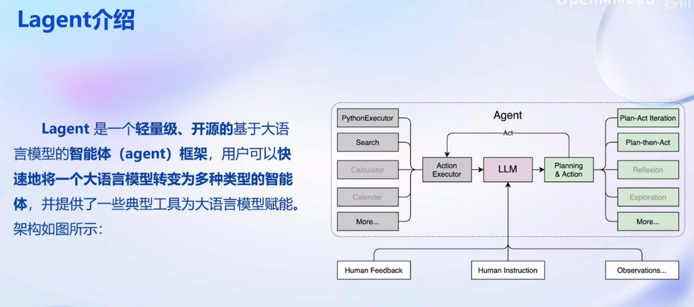
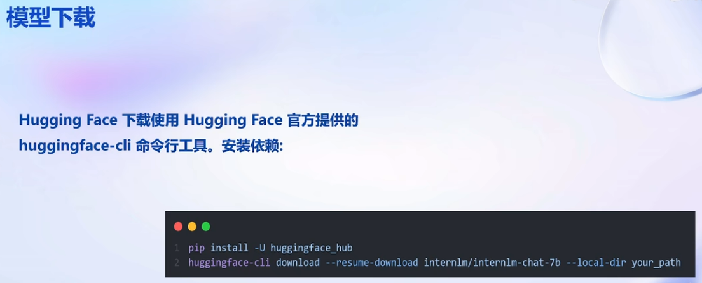
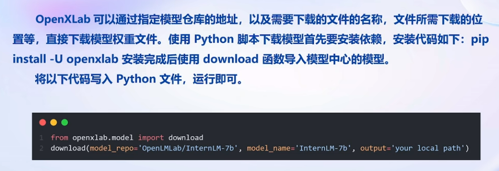
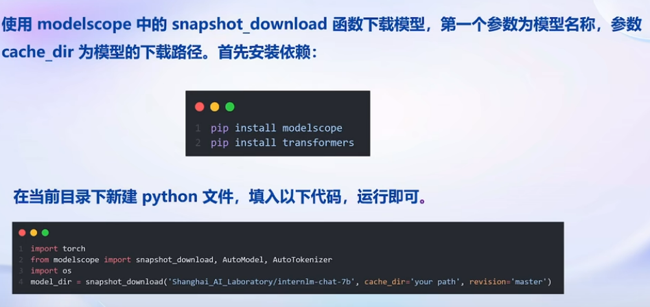

# Lecture2_Notes   
# 第2节 轻松玩转书生·浦语大模型趣味Demo  宋志学   
[第2节课件Demo视频](https://www.bilibili.com/video/BV1Ci4y1z72H/?vd_source=427d5b3bd6552cd66c00e381e2aae338)  
[第2节Demo文档](https://github.com/InternLM/tutorial/blob/main/helloworld/hello_world.md)  

Lagent介绍
  

模型下载
  
  
 

